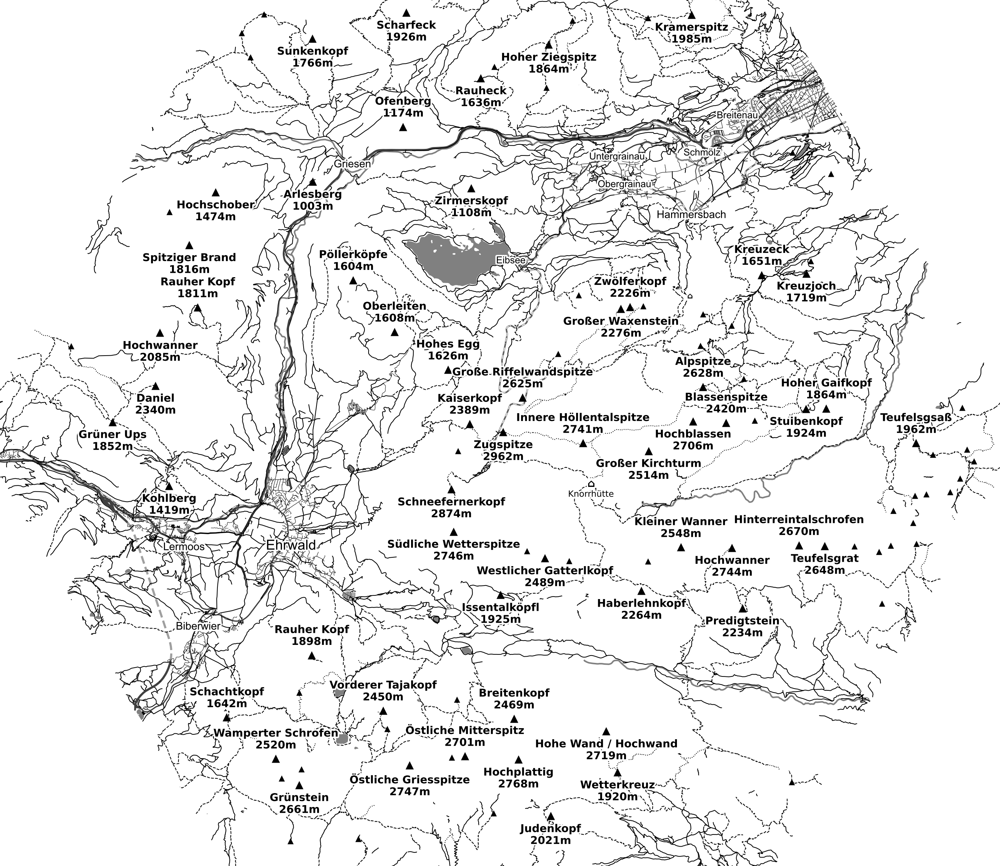
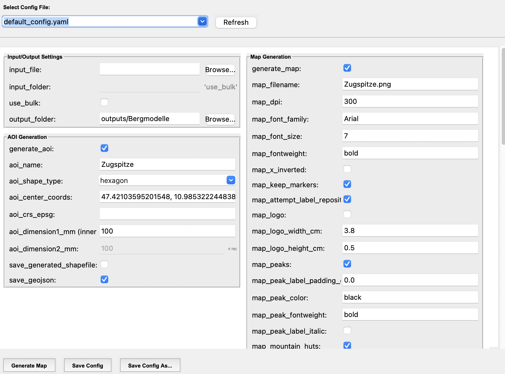

# Map Generator

A Python-based tool for generating simple maps. Intended for grayscale laser engraving. Create customizable maps featuring mountain peaks, settlements, streets, railways, water bodies, and more using OpenStreetMap data.



## Features

- **Area of Interest (AOI) Generation**: Create custom map boundaries in various shapes (circle, square, rectangle, hexagon)
- **OpenStreetMap Integration**: Automatically fetch geographic features including:
  - Mountain peaks and huts
  - Settlements (cities, towns, villages, hamlets)
  - Streets and roads (motorways, primary, secondary, residential)
  - Railways (standard, narrow gauge, light rail)
  - Water bodies (lakes, rivers, canals, reservoirs)
- **Coordinate System Support**: Automatic UTM zone detection with ETRS89 support for European coordinates
- **Configurable Output**: Customize map scale, DPI, fonts, colors, and which features to display
- **Bulk Processing**: Process multiple geometry files at once

## User Interface



## Getting Started

### Prerequisites

- Python 3.9+
- Required Python packages:
  - `PySide6` (Qt GUI)
  - `matplotlib` (map rendering)
  - `shapely` (geometry operations)
  - `pyproj` (coordinate transformations)
  - `pyshp` (shapefile handling)
  - `PyYAML` (configuration)
  - `requests` (OpenStreetMap API)

### Installation

1. Clone this repository:
   ```bash
   git clone https://github.com/yourusername/map-generator.git
   cd map-generator
   ```

2. Install dependencies:
   ```bash
   python3 -m pip install -r requirements.txt
   ```

### Usage

#### Basics
1. Launch the graphical user interface:
   ```bash
   python3 src/ui.py
   ```

   Map generation runs in the background. The window stays responsive and reports
   progress and any failures; configuration controls are disabled until it finishes.

2. Configure your map:
   - Set the center coordinates (latitude, longitude) and choose the AOI shape and dimensions
   - Alternatively provide a custom shapefile
   - Select which map features to include
   - Configure styling options (fonts, colors, scale)

3. Generate your map and find the output in the `outputs/` folder

#### OpenStreetMap downloads and cache

Each map fetches its enabled OSM features in one combined Overpass request.
Peaks and settlements receive coordinates and tags, huts receive centers, and
roads, railways, waterways, and water polygons receive geometry. Requests remain
sequential, including in bulk mode.

`osm_cache_enabled: true` (the default) reuses downloaded geographic data for
**seven days**. The cache lives in `.cache/osm/` under the repository and is
excluded from Git. Changes to fonts, DPI, GPX styling, or projection can reuse
an entry when the geographic bounds and requested features are unchanged.
Changing the AOI or enabled feature subtypes requires a different download.

Click **Refresh OSM Data** to generate the current map or bulk batch with fresh
OSM data. This action bypasses cached reads and updates successful downloads;
it does not save a refresh flag in your configuration. For the map CLI:

```bash
python3 src/generate_map.py --config src/config/default_config.yaml --refresh-osm
```

Disable `osm_cache_enabled` in Input/Output Settings to bypass cache reads and
writes. A failed refresh reports an error and leaves the previous cache intact;
stale data is not silently used. Corrupt entries trigger a new download, and
cache filesystem problems are logged without losing downloaded data. Delete
`.cache/osm/` if you want to clear all cached data.

The terminal reports cache hits/misses, selected features, response timing, and
each actual retry. Downloads make at most **three attempts**, with a 10-second
connection timeout, a 60-second read timeout, and a 45-second Overpass query
execution timeout. Connection/read timeouts are not a total download deadline.
Transient errors use exponential backoff or the server's `Retry-After`; delays
above 60 seconds stop the run and ask you to retry later. Invalid or partial
responses are rejected and never cached. The first download still depends on
Overpass server load.

#### GPS track overlay

Select an optional `gpx_file` in Input/Output Settings to draw its track segments
as solid black lines. Set `gpx_line_thickness` in Map Generation to control the
width in points (default: 1.5; 1 point = 1/72 inch). Width must be positive and
finite. Tracks are clipped to the AOI and do not change the map extent.

```yaml
gpx_file: /path/to/track.gpx
gpx_line_thickness: 1.5
```

To center the AOI on a track, click **Compute GPX Center** below the GPX selector.
Copy the selected `latitude, longitude` result into `aoi_center_coords`. The
calculation uses the track's bounding box in the selected AOI CRS (automatic UTM
when blank); it leaves the scale, dimensions, and configuration unchanged.

An empty path disables the overlay. GPX track segments are supported; waypoints,
elevation, timestamps, and route-only files are not drawn. Invalid files are
reported before OpenStreetMap requests. The same overlay is used for bulk maps.
Older configs receive the new defaults in the UI; legacy `gpxfile` is used only
when `gpx_file` is absent. GUI paths resolve from the repository root; CLI paths
resolve from the current working directory.

#### Standalone shapefile generator

```bash
python3 src/generate_shapefile.py
```

Choose a shape, coordinates, EPSG code, and dimensions; optionally export GeoJSON.

#### Command-line map generation

```bash
python3 src/generate_map.py --config src/config/default_config.yaml
```

Launch the GUI scripts from any directory using their absolute paths. Relative
paths in GUI configurations are resolved from the repository root. The map CLI
continues to resolve relative paths from the current working directory.

#### Bulk generation

- Provide a folder with all desired shapefiles
- Set use_bulk parameter to true

### Configuration

Default settings can be modified in `src/config/default_config.yaml` and saved as custom config files. Key parameters include:

| Parameter | Description |
|-----------|-------------|
| `scale` | Map scale (e.g., 100000 = 1:100,000) |
| `aoi_shape_type` | Shape of the area of interest (circle, square, rectangle, hexagon) |
| `map_dpi` | Output resolution in dots per inch |
| `map_peaks` | Include mountain peaks |
| `map_settlements` | Include cities, towns, villages |
| `map_streets` | Include road network |
| `map_water` | Include water bodies |

## Project Structure

```
Map Generator/
├── src/
│   ├── ui.py                 # Graphical user interface
│   ├── generate_map.py       # Main map generation logic
│   ├── generate_shapefile.py # AOI geometry creation
│   ├── map_class.py          # Map rendering class
│   ├── openstreetmap_api.py  # OSM data fetching
│   ├── utm_finder.py         # UTM zone detection
│   └── config/
│       └── default_config.yaml
├── inputs/                   # Input geometry files
├── outputs/                  # Generated maps and data
└── assets/                   # Documentation images
```

## Tests

Run the UI and worker tests without a display or network access:

```bash
QT_QPA_PLATFORM=offscreen python3 -m unittest discover -s tests -v
```
